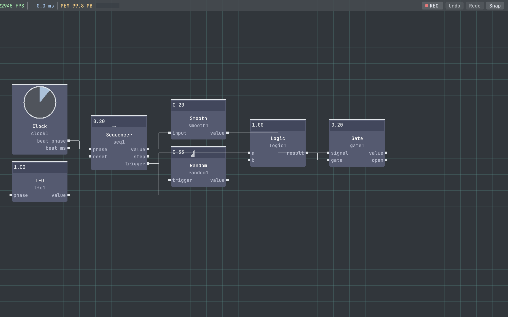

# vivid-sequencers

`vivid-sequencers` is a Vivid package library that provides sequencing control operators:

- `sequencer`
- `drum_sequencer`
- `pattern_seq`
- `note_pattern`
- `note_duration`
- `arpeggiator`
- `chord_progression`
- `state_machine`
- `tracker`
- `euclidean`
- `pat_transform`
- `phase_to_midi`

## Preview



## Contents

- `src/*.cpp` for the 12 operators
- `graphs/arpeggiator_demo.json`
- `graphs/chord_progression_demo.json`
- `graphs/control_demo.json`
- `graphs/state_machine_demo.json`
- `graphs/pattern_algebra_demo.json`
- `tests/test_package_manifest.cpp`
- `tests/test_audio_operator_contracts.cpp`
- `tests/test_tracker_contract.cpp`
- `tests/test_state_machine.cpp`
- `tests/test_pattern_algebra.cpp`
- `vivid-package.json`

## Local development

From vivid-core:

```bash
./build/vivid link ../vivid-sequencers
./build/vivid rebuild vivid-sequencers
```

## CI smoke coverage

The package CI workflow:

1. Clones and builds vivid-core (`test_demo_graphs` + core operators).
2. Builds package operators and package tests.
3. Runs package tests.
4. Runs graph smoke tests against this package's `graphs/` directory.
5. Keeps the direct behavior tests (`test_arpeggiator_patterns`, `test_state_machine`, `test_pattern_algebra`, `test_audio_operator_contracts`, `test_tracker_contract`) green alongside graph smoke.

## License

MIT (see `LICENSE`).
